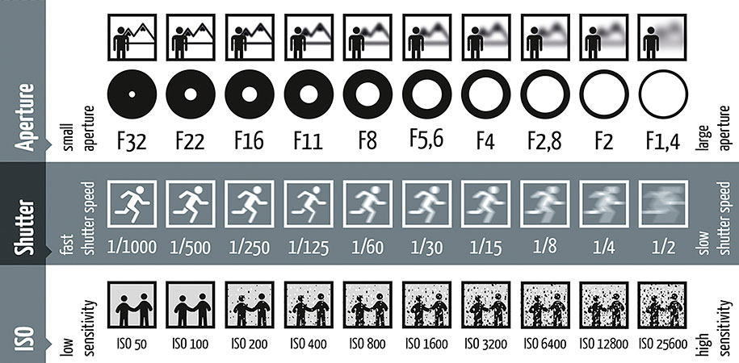

# 摄影入门指南

> 因为一个机缘巧合的机会，对摄影产生了很大的兴趣，遂买了一个二手索尼 A7 尝试学习摄影。故此尝试做一个摄影入门的备忘录。

## 基本概念

### 光圈 / Aperture

> 相机上用来控制镜头孔径大小的部件，以控制景深、镜头成像素质、以及和快门协同控制进光量。 
> —— [wikipedia](https://zh.wikipedia.org/wiki/%E5%85%89%E5%9C%88)

> 光圈的大小通常用f值表示，光圈f值=镜头的焦距除以光圈口径。 
> —— [wikipedia](https://zh.wikipedia.org/wiki/%E5%85%89%E5%9C%88)

#### 延伸资料

- [整档光圈](https://www.bilibili.com/video/BV1RY411j7Tw)
- [最佳光圈](https://www.bilibili.com/video/BV1RY411j7Tw)
- [恒定光圈](https://www.bilibili.com/video/BV1RY411j7Tw) - 标注焦段内光圈不变
- [非恒定光圈](https://www.bilibili.com/video/BV1RY411j7Tw) - 光圈随焦段变化
- [焦比](https://zh.wikipedia.org/wiki/%E7%84%A6%E6%AF%94)
- [视频] [爆肝两个月 | 用动画的方式揭开光圈和景深的秘密——掌控曝光（—）](https://www.bilibili.com/video/BV1t24y1k7Ye)

### 快门 / Shutter

> 相机中控制曝光时间的重要部件，快门时间越短，曝光时间越少。 
> —— [wikipedia](https://zh.wikipedia.org/wiki/%E5%BF%AB%E9%96%80)

#### 延伸资料

- [视频] [进阶科普｜用动画彻底搞懂“相机快门”!](https://www.bilibili.com/video/BV1Qu411p7Jj)

### 感光度 / ISO

> 衡量底片对于光的灵敏程度。 
> —— [wikipedia](https://zh.wikipedia.org/wiki/%E6%84%9F%E5%85%89%E5%BA%A6)

> 数码相机并不存在底片及底片上的化学反应，其感光度是一种类似于胶片感光度的一种指标，是一种等效感光度。 
> —— [wikipedia](https://zh.wikipedia.org/wiki/%E6%84%9F%E5%85%89%E5%BA%A6)

以上三点，**光圈**，**快门**，**感光度**合称为曝光三要素。

### 焦距 / Focal length

> 是光学系统中衡量光的聚集或发散的度量方式，指从透镜中心到光聚集之焦点的距离。亦是照相机中，从镜片光学中心到底片、CCD或CMOS等成像平面的距离。 
> —— [wikipedia](https://zh.wikipedia.org/zh-cn/%E7%84%A6%E8%B7%9D)

> 视野的大小取决于镜头的焦距和底片大小的比例。 
> —— [wikipedia](https://zh.wikipedia.org/zh-cn/%E7%84%A6%E8%B7%9D)

### 全画幅 / Full Frame

> 指的是感光元件尺寸为36×24mm。 
> —— [wikipedia](https://zh.wikipedia.org/wiki/%E5%85%A8%E7%94%BB%E5%B9%85)

> 全画幅相比更小的传感器尺寸有更好的虚化。 
> —— [wikipedia](https://zh.wikipedia.org/wiki/%E5%85%A8%E7%94%BB%E5%B9%85)

### 半画幅 / Half Frame

> 一类成像时候仅使用标准的底片格式一半尺寸大小的规格。 
> —— [wikipedia](https://zh.wikipedia.org/wiki/%E5%8D%8A%E5%B9%85)

> 最常见的半幅指的是135胶片的一半大小，约为 18x24mm。 
> —— [wikipedia](https://zh.wikipedia.org/wiki/%E5%8D%8A%E5%B9%85)

### 曝光补偿 / Exposure Compensation

> 曝光补偿也称为EV（曝光值）调整，是指在摄影过程中通过对曝光值的调整以达到最佳效果的一种技术手段。虽然有些照相机能够自动运算得出曝光值，但是得到的未必绝对正确，而且也可能不是拍摄者所想要的。这时拍摄者可以根据需要调整曝光补偿。曝光补偿增加1EV，相当于曝光值（EV）减少1，即进光量增加一倍，可以使图像更亮；反之则图像会更暗。 
> —— [wikipedia](https://zh.wikipedia.org/zh-hans/%E6%9B%9D%E5%85%89%E8%A1%A5%E5%81%BF)

> 曝光值的改变是通过改变f值和快门速度来实现的。如果相机采用光圈优先模式，则改变的是快门速度；如果相机采用快门优先模式，则改变的是f值。 
> —— [wikipedia](https://zh.wikipedia.org/zh-hans/%E6%9B%9D%E5%85%89%E8%A1%A5%E5%81%BF)

## 实战技巧

### [黑背景](https://www.bilibili.com/video/BV1x4411F7bs?p=1)

- 点测光（高光）
- 曝光补偿（负）
- 闪光灯

### [雨丝](https://www.bilibili.com/video/BV1x4411F7bs/?p=2)

- 打光（逆光/侧光）
- 色温
- 快门速度

### [水珠](https://www.bilibili.com/video/BV1x4411F7bs/?p=3)

- 微距
- 小光圈
- 手动对焦
- 延迟拍摄

### [光斑](https://www.bilibili.com/video/BV1x4411F7bs/?p=4)

- 焦外
- 延迟拍摄
- 不同镜头光斑可能不同
- 使用黑卡纸改变光斑形状

### [逆光人像](https://www.bilibili.com/video/BV1x4411F7bs/?p=5)

- 阳光（6500k）
- 手动对焦
- 点测光（高光）
- 补光（前景）
- 夕阳平射（黄金一小时）
- 前景虚化
- 前景光斑

### [暗调人像](https://www.bilibili.com/video/BV1x4411F7bs/?p=6)

- 深色背景
- 深色服装
- 点测光（高光）
- 补光（轮廓光）
- 曝光补偿（负）

### [亮调人像](https://www.bilibili.com/video/BV1x4411F7bs/?p=7)

- 浅色背景
- 浅色服装
- 评价测光（按光）
- 顺光拍摄
- 曝光补偿（正）
- 浅色道具

### [柔焦人像](https://www.bilibili.com/video/BV1x4411F7bs/?p=8)

- 丝袜
- 纱布
- 保鲜膜 + 马克笔
- 凡士林

### [夜景人像](https://www.bilibili.com/video/BV1x4411F7bs/?p=9)

- 白平衡（自动）
- 安全快门（快门速度不能低于当前焦距）
- 大光圈大光斑
- 手动对焦

### [夜景长曝光](https://www.bilibili.com/video/BV1x4411F7bs/?p=10)

- 手动曝光组合
- 小光圈（点光源会有星芒效果）
- 低速快门
- 快门线/延迟拍摄

### [多重曝光](https://www.bilibili.com/video/BV1x4411F7bs/?p=11)

- 开启多重曝光
- [模式](https://www.bilibili.com/video/BV1x4411F7bs?t=470.9&p=11)
  - 加法
  - 平均
  - 明亮
  - 黑暗

### [秋冬人像](https://www.bilibili.com/video/BV1x4411F7bs/?p=12)

- 大光圈（浅景深，前后景分离）长焦距
- 避免背后“长出来”
- 广角镜头拍摄环境人像（广取势，近取神）
- 高速快门连拍模式（拍动作）

### [圣诞创意人像](https://www.bilibili.com/video/BV1x4411F7bs/?p=13)

- 花式黑卡
- 借助环境/节日道具

### [图书馆人像](https://www.bilibili.com/video/BV1x4411F7bs/?p=14)

- 广角镜头，强化空间透视（单点透视）
- 使用长焦合理控制景深
- 三角光
- 低机位
- 借助背景使画面更加饱满

### [意大利美食之旅](https://www.bilibili.com/video/BV1x4411F7bs/?p=15)

- 尽量自然光，环境较暗可选择调高 ISO 或大光圈，或用白纸或白布补阴影光
- 机位
- 色温偏暖，更有食欲（冰淇淋等冷冻食物则相反）

### [捕捉瞬间的美丽](https://www.bilibili.com/video/BV1x4411F7bs/?p=16) - 拍摄水滴 + 牛奶皇冠

- 闪光灯（高速同步模式）打亮主体，使水滴晶莹剔透
- 拍摄时借助参照物提前对焦
- 快门速度足够快时，如亮度不够，可提高 ISO
- 使用快门线避免虚焦
- 手动曝光模式
- 小光圈拍摄，保证拍摄皇冠清晰
- 多次拍摄，掌握时机

### [新春特辑 全家福](https://www.bilibili.com/video/BV1x4411F7bs/?p=18)

- 室内拍摄人像使用闪光灯时，可通过漫反射原理，柔化光线
- 拍摄环境狭小时，最好用广角镜头，增强空间感
- 手持需要使用安全快门
- 拍摄主体运动时，才用连拍和自动对焦，保证主体清晰

### [烟花棒光绘人像](https://www.bilibili.com/video/BV1x4411F7bs/?p=19)

- 背景黑暗，提前对焦
- 夜间拍摄，用长焦镜头光斑虚化效果更好
- 手持拍摄，快门极限速度是镜头当前焦距的倒数
- 夜间拍摄保证快门速度尽量使用三脚架
- 调节白平衡，烟花棒色温接近钨丝灯；或者自动白平衡结合 RAW 格式，再后期调整
- 光圈最大以后，快门速度达不到要求时，可以提高 ISO，增加快门速度
- 拍摄光绘人像尽量使用广角镜头
- 光绘人像拍摄时间较长可以使用 B 门
- 长时间曝光快门线更加方便
- 光绘完成以后用闪光灯打亮主体凝固动作（第二帘同步/后帘同步）

### [创意光影（欧美）人像](https://www.bilibili.com/video/BV1x4411F7bs/?p=20)

- 大光圈浅景深
- 提高 ISO 也可以提供快门速度
- 是否保留背景光影效果，取决于背景的选择
- 使用强光源手电拍摄，增强光影对比
- 强调光影明暗时，黑白照片效果最佳

### [春日里的阳光](https://www.bilibili.com/video/BV1x4411F7bs/?p=21)

- 漫反射辅助照明任务，光线柔和细腻
- 背景和拍摄主体光比过大可借助道具补光缩小光比，可使用评价侧光
- 逆光 + 反光板拍摄，灵活运用逆光的优点

### [景深人像](https://www.bilibili.com/video/BV1x4411F7bs/?p=22)

- 画面层次感需要控制景深
- 镜头离前景越近虚化效果越明显
- 拍摄人物虚化前后景，使用大光圈长焦距并改变拍摄距离
- 拍摄距离越近景深越浅，模特离背景越远越利于虚化

### [发现细微之美](https://www.bilibili.com/video/BV1x4411F7bs/?p=23)

- 微距拍摄时间清晨更佳，光线清透
- 户外光线不足，可使用手电打光，逆光效果更出彩
- 微距取经范围小，选择背景时，深色背景更佳

### [青春活力之运动人像](https://www.bilibili.com/video/BV1x4411F7bs/?p=24)

- 拍摄运动场景要注意快门速度，光圈处于最大值提高 ISO 感光度
- 拍摄运动场景要使用连拍模式，关闭 RAW 格式，减少存储量
- 广角镜头俯拍被摄主体，可以拍出“大头照”效果
- 用广角镜头拍摄弯道可以呈现物理纵深感，使被摄主体显得更长

### [我和春天有个约会](https://www.bilibili.com/video/BV1x4411F7bs/?p=25)

- 大面积油菜花只能作为背景，要在若干元素中找一个主体，任务、蜜蜂、花束等均可
- 大光圈可虚化主体前后景（50mm/F1.4镜头的虚化效果较好，如果不是全时手动镜头 AF 档不能手动对焦）
- 使用小道具可增加画面活泼感（如帽子、围巾等）
- 选择着装应注意色彩的对比（红、蓝、白、浅色系较佳）
- 阴天拍摄应适当调高曝光值，画面较亮符合春光主题
- 拿花当前景，人在前后景中间，用大光圈可虚化前后景
- 背景杂乱时使用大光圈拍小景，大场景时可用广角镜头拍全景
- 拍蜜蜂时使用长焦距大光圈，微距镜头效果最佳

### [拍一张有“深度”的照片](https://www.bilibili.com/video/BV1x4411F7bs/?p=26)

- 拍摄时，选取有天然引导线的场景，增强纵深感
- 使用小光圈，大景深，广角镜头，突出空间纵深感
- 寻找框架构图，巧用折叠与层次，效果更佳

### [金川拍梨花](https://www.bilibili.com/video/BV1x4411F7bs/?p=27)

- 拍摄整体偏亮（白）的场景时要增加曝光（白加黑减）
- 天色大亮时可用渐变灰镜或者俯拍不要天空

### [旅拍之三月飘雪](https://www.bilibili.com/video/BV1x4411F7bs/?p=28)

- 相机离模特近时用小光圈也可虚化背景
- 环境人像要保留环境，不可完全虚化背景
- 模特服饰要选择与背景有反差的颜色

### [ND 镜的 N 种玩法](https://www.bilibili.com/video/BV1x4411F7bs/?p=29)

- 小光圈可以拍出慢门流水效果，光圈值缩小为 F29 或 F32 等
- 若使用小景深大光圈拍流水则需安装 ND 镜（中灰度滤镜）
- 光线太亮时则降低镜头透光度，ND 镜就相当于镜头的墨镜
- 最大光圈可虚化前后景只保留主体清晰
- ND 镜灰度有不同等级，同一口径可叠加使用
- 防止拍摄抖动可设置延迟或使用快门线
- 根据效果把控快门时间，丝状雾状牛奶状均可呈现
- 在背景人多的景点想避开人群，ND 镜 + 长曝光可拍出单人照
- ND 镜长曝光时人物身体不动只摆动手臂可拍出多臂效果

### [力量之美](https://www.bilibili.com/video/BV1x4411F7bs/?p=30)

- 当室内外光比大时使用点测光，可以营造黑背景效果
- 拍摄窄光人像，运用曝光补偿（负）光影效果更明显
- 切忌使用大平光拍摄，多尝试不同的光位拍摄

### [柔性之美](https://www.bilibili.com/video/BV1x4411F7bs/?p=31)

- 黑暗环境拍人像可借助闪光灯打光
- 利用闪光灯可以消除顶光灯直射导致的面部阴影
- 大光圈轻度过曝可虚化窗外杂乱背景
- 闪光灯压暗背景后配合大光圈虚化背景
- 当快门速度超过闪光灯同步速度时不能使用闪光灯

### [老街拍出小清新](https://www.bilibili.com/video/BV1x4411F7bs/?p=32)

- 拍摄文艺小清新画面应干净简洁，色调风格统一
- 漫射光避免照片阴暗落差，还可降低颜色对比和饱和度
- 在老街拍摄，广角镜头能够让画面视角更广，延长空间感

### [坏情绪也能拍出好照片](https://www.bilibili.com/video/BV1x4411F7bs/?p=33)

- 大雨初停后天空弥漫的雾气适合拍忧郁风格的情绪人像
- 雨后天色较暗，为突显人物，着装应选择对比强烈的颜色
- 选择可以避开直射光的环境，可消除面部直射产生的阴影
- 户外拍摄可充分利用风源，面向风源使头发飞舞更唯美
- 拍情绪模特的情绪表达是关键，注意面部表情，眼睛避免直视镜头
- 局部特写照也能传达出情绪，远/全/中/近/特是完整的一组
- 特写时前后景之间的距离很近，使用大光圈镜头拉开层次感
- 局部特写可部分空间留白，给人以想象空间

### [森林里的小精灵](https://www.bilibili.com/video/BV1x4411F7bs/?p=35)

- 森林系色彩以绿色为主，借助绿叶等前景更有层次感
- 有些植物生长过高离地较远，可借助台阶拉进空间距离
- 模特采用光脚等原始姿态更易使画面富有梦幻色彩
- 拍摄森林系照片道具很重要，可借助花环鹿角等小道具
- 反光板最中间一层可以取出当做柔光板单独使用
- 当背景较为杂乱时，使用高机位俯拍效果更佳
- 低机位用草当前后景让模特充分与绿色植物相融合
- 应尽量营造梦幻的拍摄场景，飞舞的跑跑等具有童话色彩
- 夕阳照射到树荫下的草坪上形成了一个天然的冷暖对比
- 使用抓拍或连拍的拍摄方式，捕捉跳跃的姿态会增加活泼感

### [老司机带你拍私房照](https://www.bilibili.com/video/BV1x4411F7bs/?p=36)

- 拍摄时应选择简洁的房间和浅色系的服装
- 拍摄不同风格时，模特的眼神很重要

### [路过你的全世界](https://www.bilibili.com/video/BV1x4411F7bs/?p=37)

- 环境人像重在体现环境，应选择广角镜头拍摄，视角不能太窄
- 35mm/F1.4 镜头不光有广角，还有大光圈，可虚化背景
- 长巷道由于有线条的牵引，纵深感更强会显得更加悠远
- 夕阳时色温偏暖，光线柔和更适合展现女性的柔美
- 当拍摄场景有许多重复元素时，正面拍摄可以表现画面的形式感
- 画面里出现任何可对比的元素就可以形成对比式构图
- 需要表现某个物体的悠长可以采用对角线构图
- 绿色的青苔和夕阳投下的光影形成了一个天然的冷暖对比
- 室内拍摄时室外亮室内暗需借助反光板给主体补光
- 补光时将人物全部打亮易显胖，打亮侧面拍摄 45℃ 角侧脸显瘦
- 想交代环境应选用广角镜头，视角窄的镜头适合拍人物特写
- 在天台等高处拍摄地面环境，尽量采用高机位俯拍

### [屌丝相机也能拍出女神范](https://www.bilibili.com/video/BV1x4411F7bs/?p=38)

- 越是长焦镜头对物理空间越有压缩作用
- 一般情况下，性价比高的镜头可满足 70% 以上的拍摄需求
- 极端光线条件下，如拍摄星空等，价格越高成像质量越好
- 不做盲目器材党，提高拍摄技巧是关键

### [假装在旅行](https://www.bilibili.com/video/BV1x4411F7bs/?p=39)

- 长焦镜头对物理空间有压缩感，同时也可虚化背景，适合拍人像
- 如果需要突显地位环境，采用高机位俯拍的方式
- 广角镜头的物理透视感强烈，会使被摄主体更突显近端大远端小
- 拍运动物体快门速度不宜太高，虚实结合方能增添画面的动感

### [风光摄影可以这样拍](https://www.bilibili.com/video/BV1x4411F7bs/?p=40)

- 巧用构图，寻找恰当的视觉落脚点
- 广角镜头（小光圈）让照片视角更广，营造出空间感
- 最佳时机日出日落，之前之后一两个小时
- 长曝光可以将湖水拍平，白天可以通过 ND 镜放慢快门

### [揭秘水下摄影](https://www.bilibili.com/video/BV1x4411F7bs/?p=41)

- 在博物馆等较亮环境下拍摄时，可用偏振镜消除非金属表面的反光
- 模特在水下游动时易印上水波纹，应多拍注意影棚灯回电时间

### [小区泳池 拍出夏日清凉感](https://www.bilibili.com/video/BV1x4411F7bs/?p=42)

- 强光无阴暗处，可使用柔光板
- 光比过大可只拍暗部

### [如果用闪光灯拍摄夜景人像](https://www.bilibili.com/video/BV1x4411F7bs/?p=43)

- 在光线充足的环境拍夜景人像使用大光圈镜头不需要借助辅助光
- 如果室外无有效反光体，可利用房顶跳闪柔光效果更佳，跳闪时会反射与天花板同色的光线
- 在较暗的背景下拍摄应使用固定机位加长曝光模式
- 闪光灯有手动和自动两种模式，新手自动即可
- 给闪光灯添加柔光罩可减弱光线，塑料袋纸巾等半透明材质均可
- 闪光灯的感光器具有测光功能，使用柔光罩时避免遮挡感光器
- 正补偿回电稍快，负补偿回电稍慢，黑暗下，低 ISO 拍照会减慢回电速度
- 为减少闪光灯功率加快回电速度，应适当提高 ISO 且注意避免噪点
- 焦平面快门由前后帘两部分构成，闪光灯的闪光方式分为前帘和后帘
- 后帘同步时前帘打开后不闪光，在后帘关闭前才闪光并完成曝光

### [家居清凉人像](https://www.bilibili.com/video/BV1x4411F7bs/?p=44)

- 狭窄的空间使用广角镜头，环境光线较暗时，可使用大光圈镜头，低感光度，画面更纯净
- 室内外光比过大，可补光，暖光照片体现冷暖对比

### [夏日最美丛林光](https://www.bilibili.com/video/BV1x4411F7bs/?p=45)

- 光线从背后射向主体打亮边缘，形成的轮廓光使主体与背景分离
- 拍摄轮廓光时轮廓光为主光源，是否添加辅光根据整体光线而定
- 借助大光圈镜头拍照可将树荫下的光线拍成光斑效果

### [微距小人国](https://www.bilibili.com/video/BV1x4411F7bs/?p=46)

- 背景
- 打光
- 光圈

### [如何拍好一张清新机车照](https://www.bilibili.com/video/BV1x4411F7bs/?p=47)

- 着装色彩搭配
- 对比度低饱和度低便于后期调色
- 高机位更好展示一个平面
- 点测光对准模特面部，评价测光根据曝光补偿正负值调整（直方图）
- 低机位拍摄而相机无翻转屏时，自动对焦后改手动用屏幕取景器

### [微光人像](https://www.bilibili.com/video/BV1x4411F7bs/?p=48)

- 远离光污染，突出主体，在暗光下拍摄，更容易表现唯美静谧的情绪
- 大光圈镜头：适应光线的范围广，在光线弱的时候，能够提高快门速度，更好的凝结动态
- 光斑的形成，不仅仅由大光圈决定，还受限于镜头的通光孔径。通光孔径越大，光斑越大。所以大光斑需要长焦距（50mm 以上）

### [极简线条美](https://www.bilibili.com/video/BV1x4411F7bs/?p=49)

- 暗调高反差多使用侧光或半逆光，为勾出轮廓应避免使用正面光源
- 两侧同时打光会勾出两个轮廓，拍侧极简单条轮廓应使用单侧光
- 四角柔光箱的光源面积比较大，打向模特的光线较多使亮部较广
- 光源越广，光线越柔和，光源越窄，光线越强硬
- 身体侧面轮廓是一条完整的曲线，模特着装应避免阻挡线条的流畅
- 头稍仰时往上看，低头时则往下看，最好使眼睛瞳孔与透镜光轴垂直
- 去掉柔光罩使模特脑后的光线强烈，然后散泻到脸上突出窄边轮廓线条
- 调整变换不同的光线颜色及光位，可以创造出不同风格的色彩人像
- 将不同色彩的光源放于同侧并列可为被摄者拍出多重色彩的影子

### [如何拍好一张有格调的水果照](https://www.bilibili.com/video/BV1x4411F7bs/?p=51)

- 背景选择要简洁干净，黑色白色干净的纯色背景均可
- 若没有专业的影棚拍摄光源，可借助台灯节能灯等现有光源
- 后侧轮廓光加正前侧辅助光源即可完成静物摄影的补光需求
- 十字线构图的横竖向垂直交叉可给画面增加一点情趣和活力
- 画面色彩选择要注意颜色搭配，有对比有反差画面效果更佳
- 素色的纱巾柔软具有褶皱感代替台布使用比较具有美感
- 白色背景和环境可发射光源，单灯加白色背景可实现双灯效果

### [最美不过下雨天](https://www.bilibili.com/video/BV1x4411F7bs/?p=52)

- 玻璃作为前景增加画面质感，烘托朦胧的氛围，一般用手动对焦更灵活
- 雨水下落的速度很快，要拍雨丝需要慢门；雨滴拍成光斑装用长焦大光圈，高速快门
- 雨后利用地面的积水可以充当前景，制造朦胧的效果

### [静物摄影之玻璃制品](https://www.bilibili.com/video/BV1x4411F7bs/?p=53)

- 拍摄灯光进行左右方向对称布光，可以拍摄出两条白边的玻璃杯
- 玻璃器皿在白色的环境背景中时要拍出物品的黑色边缘才不会被淹没
- 静物台是塑料光面材质会反光，为其铺上绒面哑光衬布可避免背景反光

### [穿越回民国](https://www.bilibili.com/video/BV1x4411F7bs/?p=54)

- 有特征的背景才能够区别于人，起到一个衬托的作用
- 评价测光适用于光比不大的情况
- 传统摄影中称低光为恐怖光或鬼光，会使被摄主体显得残暴、阴险和恐怖
- 学会利用特殊天气的光线展现主体，用大光圈虚化背景达到虚实结合

### 弱水金沙湾拍最美胡杨林

[1](https://www.bilibili.com/video/BV1x4411F7bs/?p=55)
[2](https://www.bilibili.com/video/BV1x4411F7bs/?p=56)
[3](https://www.bilibili.com/video/BV1x4411F7bs/?p=57)

- 沙漠中的线条感明显适合拍摄极简构图，使画面更简洁大气
- 拍摄剪影时，曝光用点测光，对准画面中最亮的部分，或者把曝光值减小一档，避免过曝
- 拍摄星空时要找一些适当的前景，会使得画面有层次感
- 星空拍摄以夏季与初秋最佳，星空时间长，月亮升起晚
- 只要带有 B 门拍摄的相机均可拍摄，附加相机快门线和三脚架手电等
- 拍摄环境越黑越好，避免光污染，星空会更易展现且画面更为简洁
- 合理使用反光板预升功能，可以防止抖动，提高拍摄质量
- 拍摄星空应该对焦到无穷远，轻微失焦会使星星显得更大
- 在大风天气下拍摄升起三脚架中轴，易使脚架产生晃动，导致画面模糊
- 拍摄星空尽量避免月圆之夜，减少光照，晚上十点到午夜两点之间为最佳拍摄时间
- 拍摄星空，广角大光圈镜头更合适
- 拍摄星轨首先要找到北极星，所有星星都是以北极星作为中心点来转圈的，最好使用广角镜头，鱼眼镜头，广角定焦，广角变焦都是不错的选择，长时间曝光需要降噪效果非常好的高档器材，普通摄影器材可通过堆栈的方式，在同一固定机位拍摄多张照片，再通过后期合成星轨
- 相机自带的降噪功能无法区分噪点和星星，拍摄星空时应关闭此功能

### [室内用光技巧](https://www.bilibili.com/video/BV1x4411F7bs/?p=58)

- 室内拍摄效果，关键在于摄影补光，要学会控制光线，要了解控制光线的特性，光比色温等
- 室内光线不足时，适当补光
- 室内很多时候都是从上到下的灯光，顶光很大程度上会给人物面部造成非常深层的阴影，需要根据情况适当补光

### [教堂烛光唯美人像](https://www.bilibili.com/video/BV1x4411F7bs/?p=59)

- 室内拍摄效果，关键在于摄影补光，要学会控制光线，要了解控制光线的特性，光比色温等
- 灵活使用道具，使用蜡烛，可烘托浪漫唯美的气氛，增加画面层次感
- 拍摄烛光人像时，室内光线微弱，可用 LED 灯补光，营造冷暖对比

### [市井街道也可以拍出好照片](https://www.bilibili.com/video/BV1x4411F7bs/?p=60)

- 为非专业模特拍照时，要善于发现被摄主体的长处并扬长避短
- 人流密集街道环境较为杂乱，要尽量选择简洁的背景拍照
- 室外阳光下拍照首先要观察光并考虑光和背景间的协调性
- 一般超过一秒的曝光时间即为长曝光
- 利用明亮的灯箱广告牌拍照，可增加人物的光亮，使面部更洁白纯净
- 透过玻璃上反射的静物拍摄，利用灯光制造的光斑营造朦胧浪漫的氛围
- 玻璃制品极易反光，拍照时避免杂乱的影子影响美感
